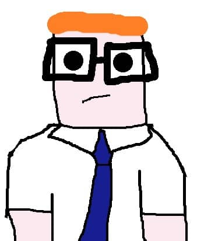

## Stuff to do:
- Required
    - Add a datatable to display the current events.
    - We will need to build this from scratch ourselves.
     
- Future
    - Add months to game, firing the event call at random.
    - Add date to event when returned, so it appears event happens on a given day
    - Add two outcomes to each choice in table (use nested sets?)

